### US Vehicle collision Analysis using AWS Glue

This guide outlines standardized procedures for developing Apache Spark jobs in Scala for AWS Glue deployment. 
It covers setting up environment variables, installing IntelliJ IDEA with the Scala plugin, and creating a Scala Maven project. 
The document explains compiling the project into a JAR for seamless Spark integration. 
In AWS Glue, developers learn to write jobs, specify dependencies, and deploy applications. 
The guide also provides insights into debugging and troubleshooting. It serves as a starting point for developers leveraging Apache Spark 
in AWS Glue for efficient, robust, and scalable Data Processing applications.

#### Contents
1.	Setting up development environment in Windows 
      
      a.	About winutils.exe
      
      b.	Configuration
      
      c.	IntelliJ IDEA IDE

      d.	Setting up AWS Credentials
2. Developing a Scala Spark Application
      
      a.	Blurb
      
      b.	Data

      c.	Problem Statement

      d.	Solution
3.	Deploying a Scala Spark Application on Glue
      
      a.	Upload application jar on S3
      
      b.	Prepare your account for AWS Glue
      
      c.	Creating a AWS Glue job	
      
      d.	Running the Glue job
      
      e.	Monitoring the Glue job
      
      f.	Debugging the Glue job

#### 1.	Setting up development environment in Windows

##### a.	About winutils.exe

winutils.exe is a utility executable used by Apache Hadoop to provide some functionalities on Windows operating systems. It includes components that are typically available on Unix-like systems but are missing or implemented differently on Windows.
When working with Apache Hadoop-based applications, such as Apache Spark, on Windows, you may encounter the need for winutils.exe. Here are a few points to understand its role:

1.	File System Operations:
      Hadoop applications often rely on the Hadoop Distributed File System (HDFS) for distributed storage. winutils.exe helps provide some basic file system operations necessary for HDFS.
2.	Permissions and Security:
      On Unix-like systems, Hadoop relies on Unix-style permissions and security models. Since Windows has a different security model, winutils.exe helps bridge the gap by providing implementations of certain operations needed for security features.
3.	Spark on Windows:
      Apache Spark requires certain Hadoop components, to perform file system operations or handle security aspects when running on Windows. winutils.exe provides a wrapper for these components acting like a Hadoop simulator for Spark.

##### b.	Configuration

1.	Download
      https://github.com/steveloughran - contributor to apache/hadoop
      Download the compatible version and set it in a safe directory.

2.	Setting up environment variable
      When running Hadoop or Spark on Windows, it's common to set the HADOOP_HOME environment variable to the directory containing winutils.exe. This helps the applications locate and use this utility.

Start > Edit the system environment variables
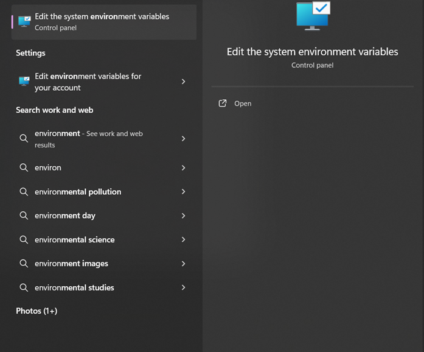

Below dialogue box pops up
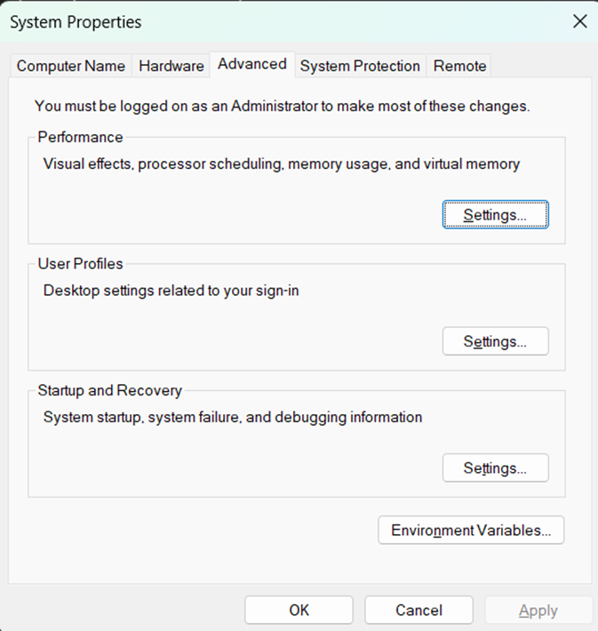

Click Environment Variables
Under System Variables, click on “New”
Variable Name: HADOOP_HOME
Variable Value: C:\\path\to\winutils.exe
Select the Path variable > Edit > New > Paste %HADOOP_HOME%\bin > OK
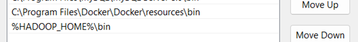

##### c.	IntelliJ IDEA IDE
IntelliJ IDEA is a powerful integrated development environment (IDE) designed to enhance the productivity of developers across various programming languages, including Java, Kotlin, Scala, Groovy, and more. Developed by JetBrains, IntelliJ IDEA offers a comprehensive set of features and tools to streamline code development, analysis, and debugging.

1.	Download
      https://www.jetbrains.com/idea/download/download-thanks.html?platform=windows&code=IIC

2.	Install Scala Plugin
      File > Settings > Plugins > Market Place > Search for “Scala“ > Install
      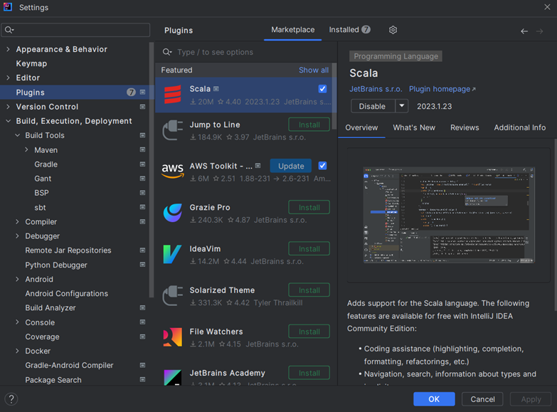

d.	Setting up AWS Credentials

	Create User in AWS IAM
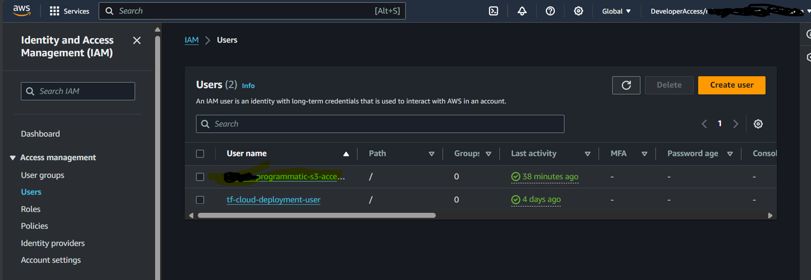

	Add required permissions policies for the user – ReadOnlyS3Access
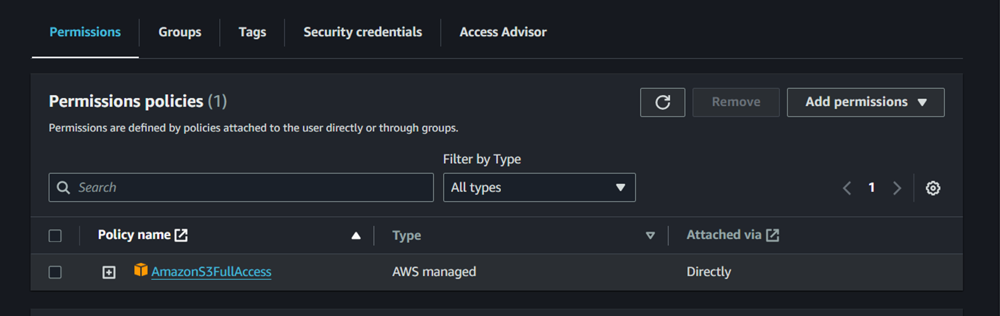

	Create Access Key for programmatically accessing S3 bucket from outside AWS
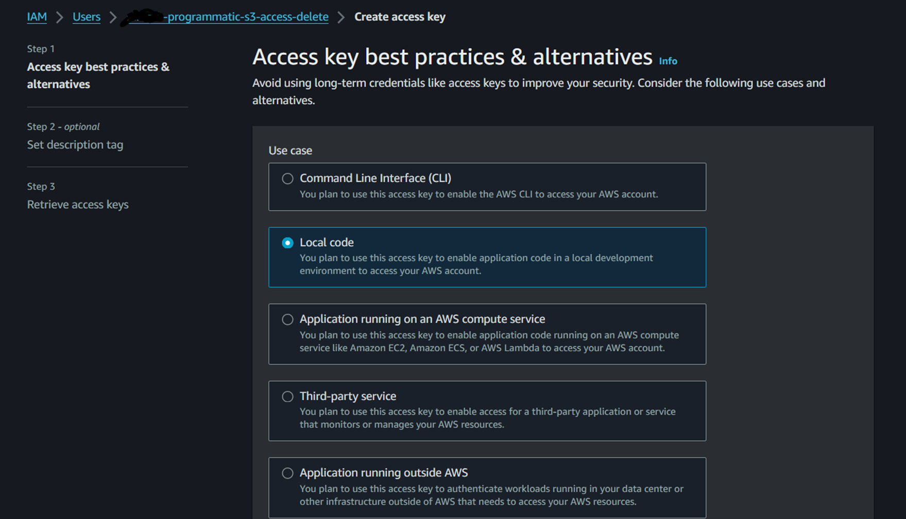

	Install AWS Toolkit plugin from Marketplace in IntelliJ IDEA IDE
File > Settings > Plugins > Market Place > Type AWS Toolkit in search bar > Install
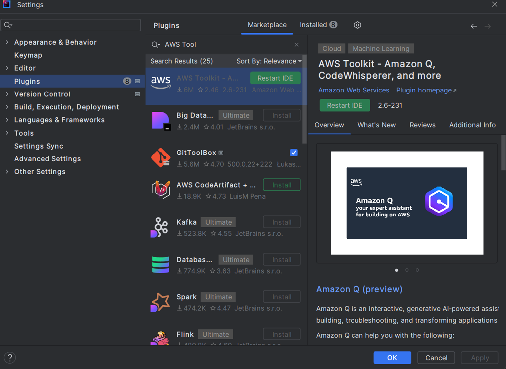

	Add AWS Credentials in AWS Toolkit
View > Tools Window > AWS Toolkit

In the AWS Explorer window, right-click on "Credentials" and choose "Create new credentials profile."
Enter the Access Key ID and Secret Access Key obtained in step 2.
You can now use this profile to interact with AWS services from within IntelliJ IDEA.

#### 2. Developing a Scala Spark Application

Developing a Scala Spark Application is like developing one in Java since Scala is built on top of Java. We can use build tools like Maven, Gradle, Ant, and more commonly for scala, SBT building
I will be using Maven for this build on IntelliJ IDEA community edition IDE.

##### a.	Blurb

This Spark application reads US vehicular crash data from either “AWS S3 bucket” or "MySQL” table, performs some basic computations on the data and stores them back to either “AWS S3 bucket" or "MySQL” tables. The intention of the application is to serve as an example of lifecycle of the Scala Spark Application deployed in AWS Glue.

##### b.	Data

Link: Monroe province car crash 2003-2015.csv (6.54 MB) (kaggle.com)
The dataset contains information on the vehicular crashes that took place in the city of Monroe province from 2003 to 2015 in csv format.
The data contains the following columns:
1.	Year
2.	Month
3.	Day
4.	Weekend?
5.	Hour
6.	Collision Type
7.	Injury Type
8.	Primary Factor
9.	Reported Location
10.	Latitude
11.	Longitude

##### c.	Problem Statement

We will be using this data to analyse the following:
1.	Which is the most common type of collision - the count of each collision type per year
2.	Which Factor caused the most collisions per year - the count of each Factor per year
3.	Which Factor caused the most collisions - the count of each Factor from beginning
4.	Which Factor caused the most casualties - the count of casualties per Factor

##### d.	Solution

###### 1.	Block Diagram
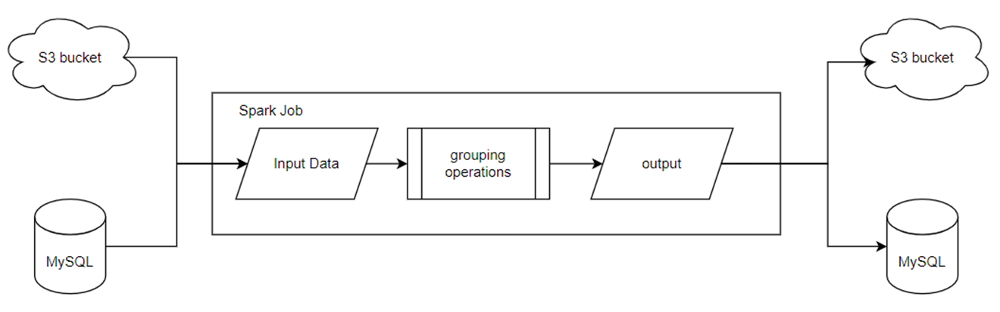

###### 2.	Connection Strings

For S3:
    The URI for the input data
    s3://minesh-glue-demo-delete/data/crash_data.csv

	For MySQL:
    The URL of the MySQL database = "jdbc:mysql://admin@minesh-glue-rds-database-delete.cswckcclgwnu.us-east-1.rds.amazonaws.com:3306/glue_db?useSSL=false"
    The table name where the input data is store = "crash_data"
    The username of the database = "username"
    The password of the user for the database = "password"
    The driver to use for connecting to the table = "com.mysql.jdbc.Driver"
    The output table names (assuming the output tables are in the same database as the input – else, the connection strings of the destination database are also required)

###### 3.	The Code

The code contains the following objects
a.	GlueApp
This is the entry object to interact with AWS Glue asking it to run the main Spark application – the contents of this object are copied to the main Glue script while creating a Glue Job later. It’s only present for reference.
b.	JobProperties
This object contains the properties required for the application in key: value format
c.	DataTypes
This object contains the case classes for the data that flows through the application for Strong Typing
d.	JobRunner
This is the application’s primary object that contains the main method. It initializes the Spark Session, calls the input, process, and output methods based on the user arguments
e.	DataTransfer
This object contains the input and output methods that read/write from/to S3 bucket and MySQL database
f.	DataProcessor
This object contains the methods that analyse the input data and processes it based on the user needs
g.	GlueSampleExtractor
This object is used for extracting sample data from the data source and stores it in the local development system for testing purposes. This object is only used for development and not used in production or deployment.

###### 4.	Application Building Steps

a.	Create a new project
Details:
Generators: Maven Archetype
Name: <project_name>
Location: <location of the project on filesystem
JDK: Java 1.8
Catalog: Maven Central
Archetype: org.scala-tools.archetypes:scala-archetype-simple
Version: <whichever_you_prefer>
Advanced Settings
GroupId: <project_group_id>
ArtifactId: <project_artifact_id>
Version: <project_version>
	Create
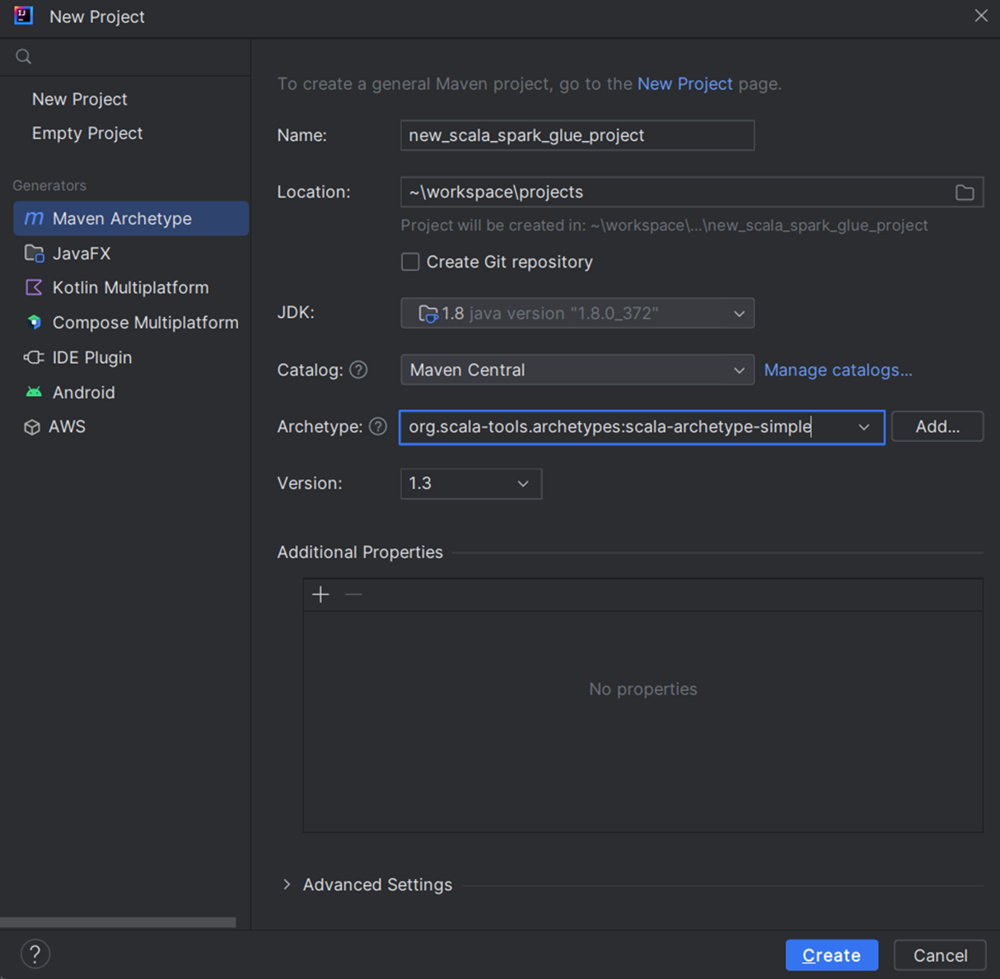

b.	Add Scala SDK for the project

File > Project Structure > Global Libraries > Click on the + button > Scala SDK > Download > Choose scala version > OK
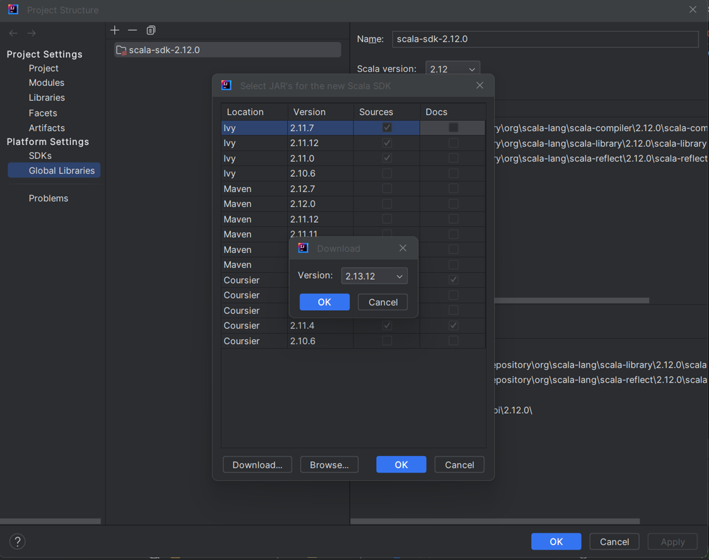

c.	Add dependencies in pom.xml
d.	Write tests for the code
e.	Download sample data
Use the GlueSampleExtractor class to download sample data from the data source for testing the code
f.	Run tests
g.	Building the jar file

Open the project main object -> Right Click > Run Maven > clean install
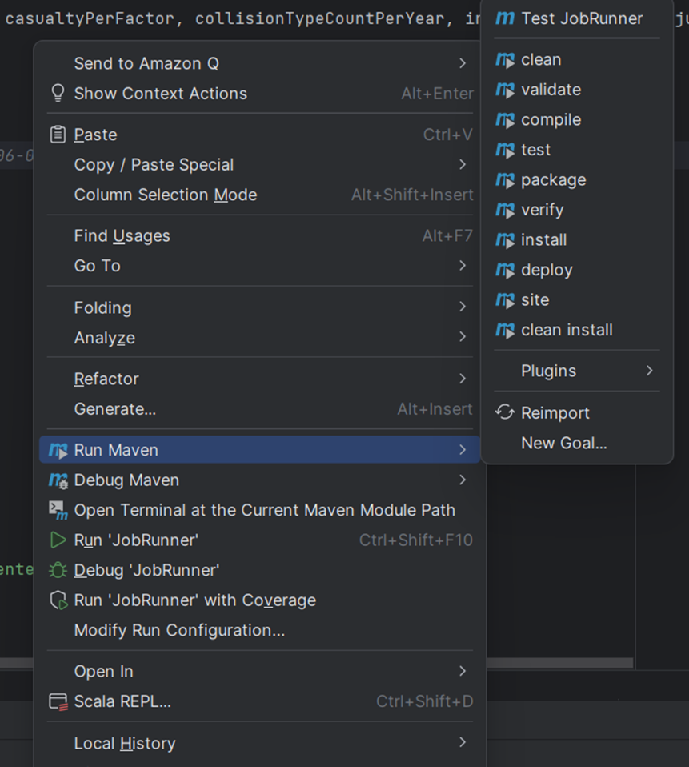

This will create a jar file under ~/target/<artifact_id_version.jar>
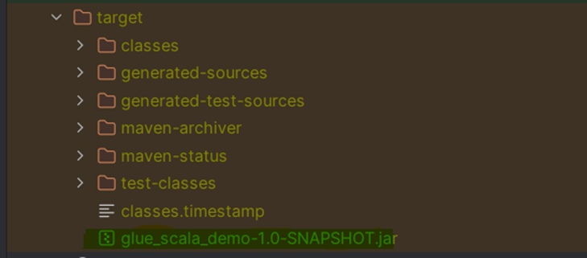

##### 3.	Deploying a Scala Spark Application on Glue

a.	Upload application jar on S3
This jar will be used as a dependency for the Glue job. Upload all other dependent jars as well.
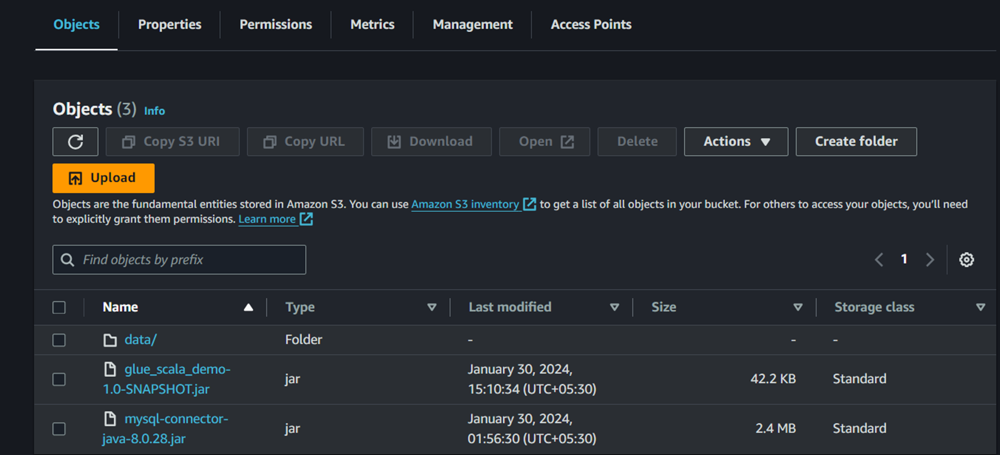

b.	Prepare your account for AWS Glue

1.	Create IAM Role > Choose AWS Service > Select Glue under User cases
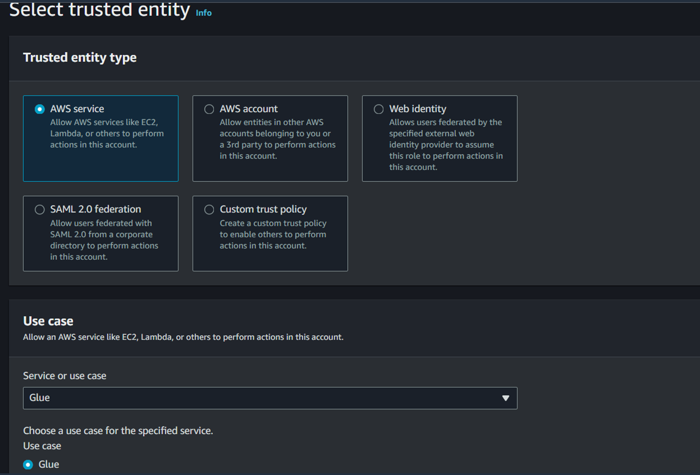

2.	Assign S3FullAccess Permissions to the role
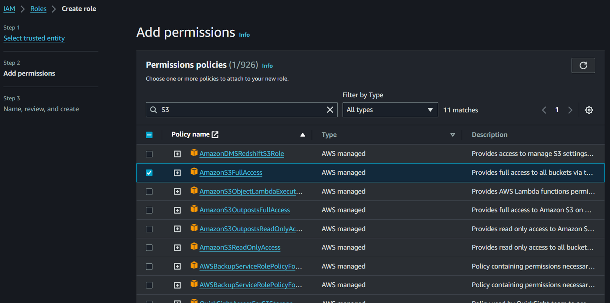

Make sure the following policies are attached
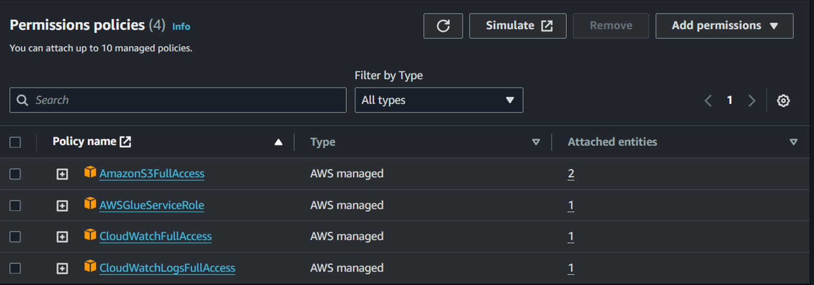

3.	Enter Role Name > Create
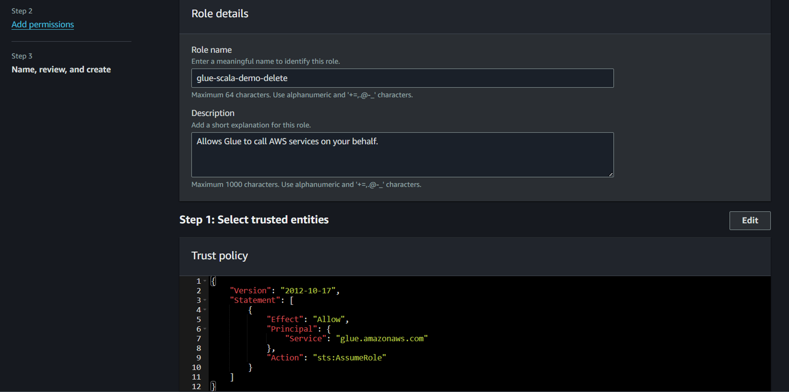

c.	Creating a AWS Glue job

1.	Select the Script editor under Jobs > Engine: Spark > Start Fresh > Create script
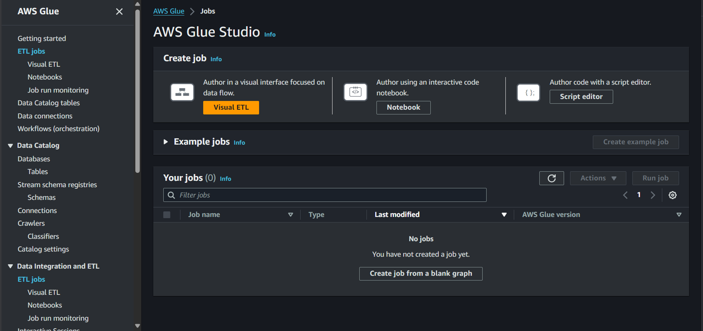

2.	This will open a Glue job page.
      Switch to the Job details tab and enter the following details

Name: <Name_of_glue_job>
IAM Role: <role_created_in_previous_step>
Type: Spark
Glue Version: Glue 4.0
Language: Scala

Open advanced properties
Script filename: <Name_of_glue_job>.scala

Under Libraries in Dependent JARs path, paste the URI of the application jar uploaded to S3
Paste comma separated URIs of all other dependent jars as well (like JDBC driver jars)
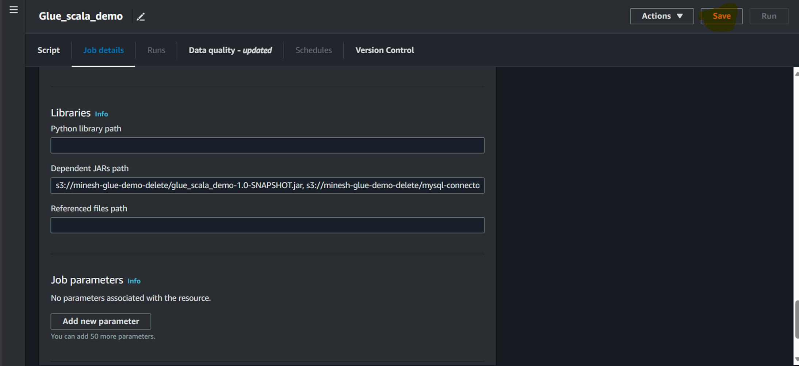

Once done, click on Save

3.	Switch back to Script tab and paste the contents of the GlueApp object in the application code in your IDE
      Remember to import the main object of the application.

The object name of this script MUST BE GlueApp
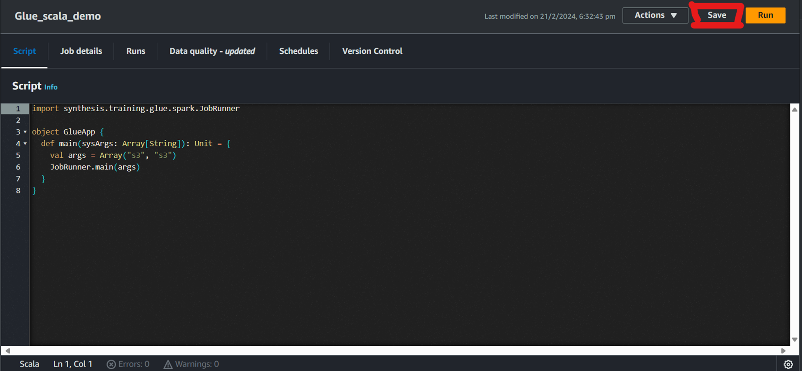

Once done, Click on Save. This will create a Glue Job that will call the application’s main class. You can pass application arguments in the args variable.
The Glue job is now ready to run.

d.	Running the Glue job

Click on the Run button on the top right corner
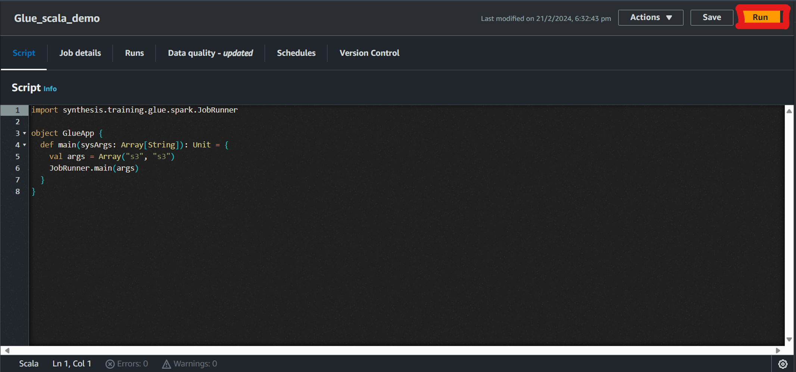

This will start the Glue Job

e.	Monitoring the Glue job

Switch to the Runs tab
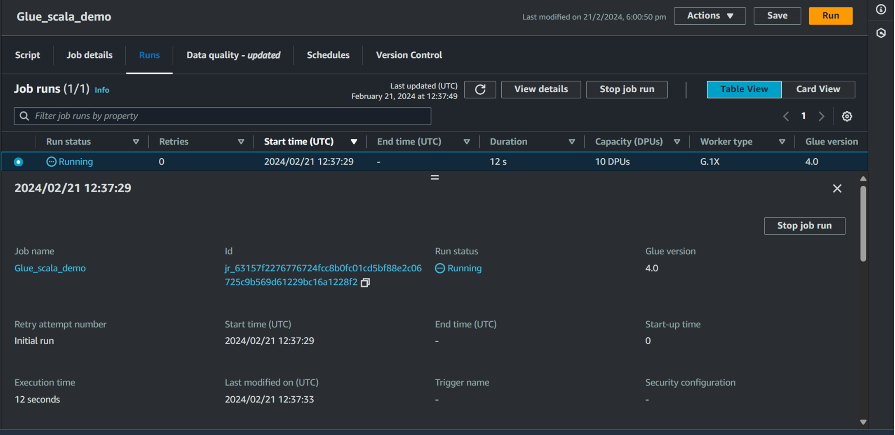

f.	Debugging the Glue job

If the job fails, we can the output logs and error logs to debug the job.
The link will open AWS Cloudwatch logs which is integrated into the Glue job
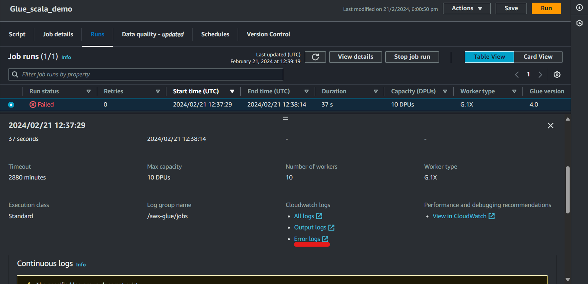

After opening the link, click on the generated log stream
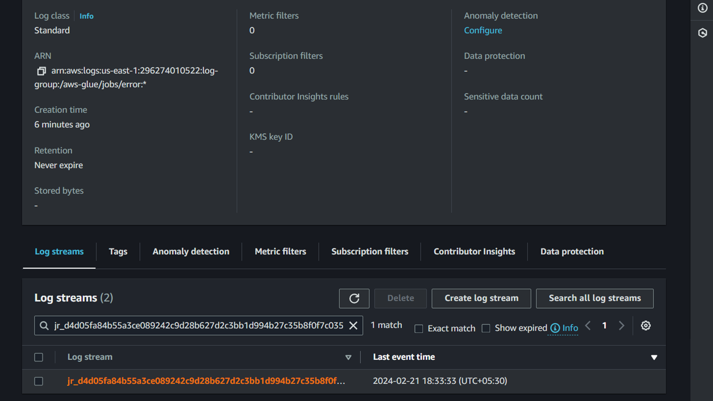

That will open the logs for debugging
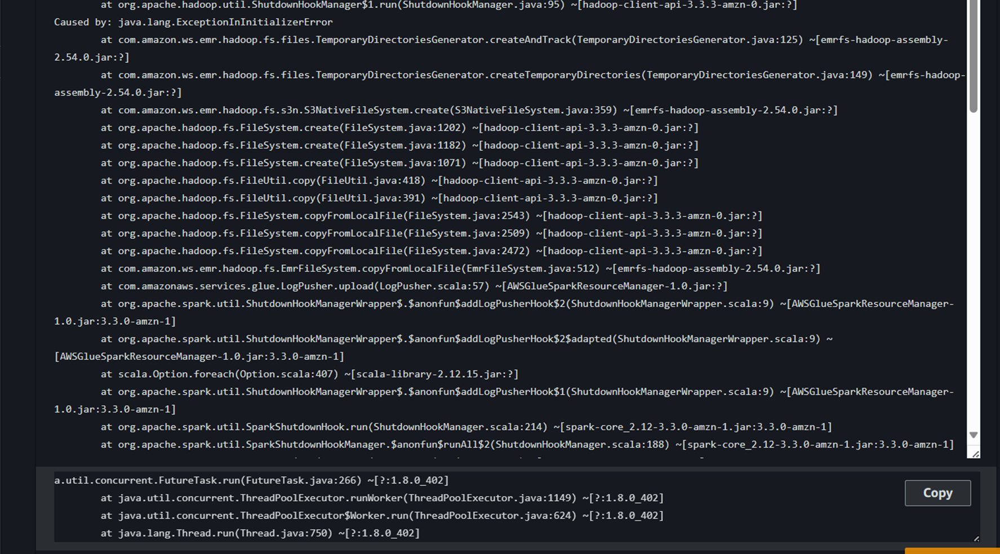

Once, you have addressed the error, you can rerun the job and wait for it to complete, post which, you will get the following success screen.
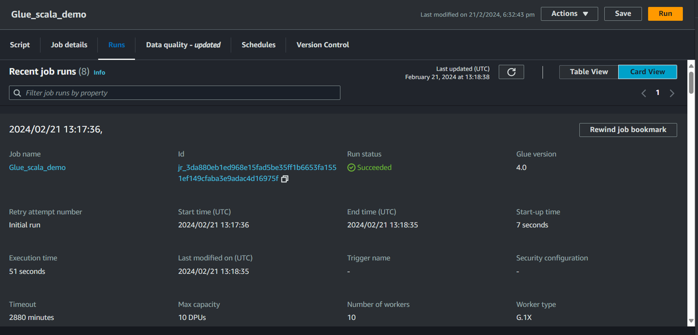

There we go! The hello world of AWS Glue jobs!

In conclusion, this documentation equips developers with a streamlined approach to leverage Apache Spark in AWS Glue coupled with Scala, 
enabling them to build robust and scalable ETL solutions. By following these standardized procedures, developers can transition from local 
development to cloud deployment. Whether you are a seasoned developer or just starting with Spark, this guide provides a foundation for 
harnessing the power of distributed data processing in the AWS Glue environment.
There are alternatives such as Amazon EMR to deploy Spark-scala application which will be explored and documented in the upcoming days, 
which will enable us to weigh the pros and cons for each technology against the application.